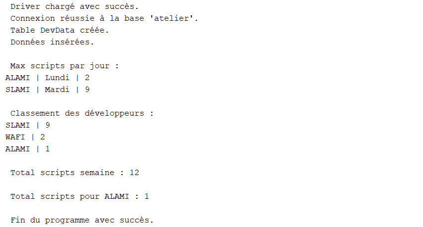
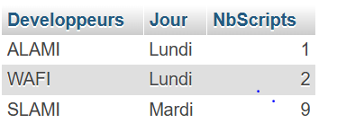
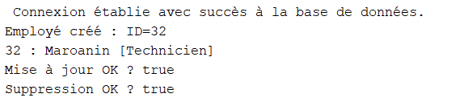
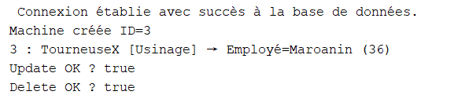

# 🧠 TP1 - Programmation JAVA AVANCE

Ce projet contient les exercices du TP1 en JAVA JDBC .

## 📸 Captures d’écran

Voici les résultats d’exécution :

Suivi des Scripts des Développeurs :





Gestion des Machines et Employés (JDBC en Couches)  :

Emloye :



Machine




---

## ⚙ Compilation
```bash
g++ main.cpp -o main
./main